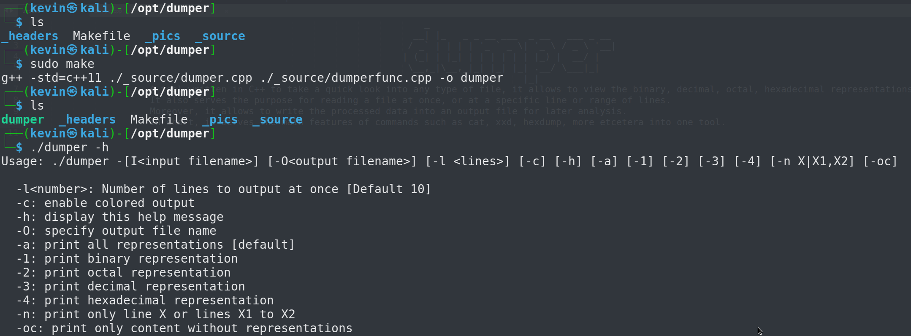
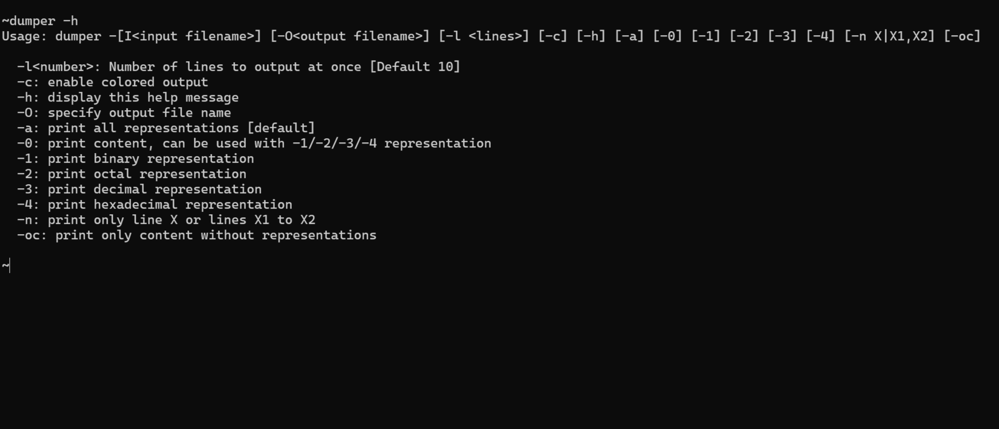
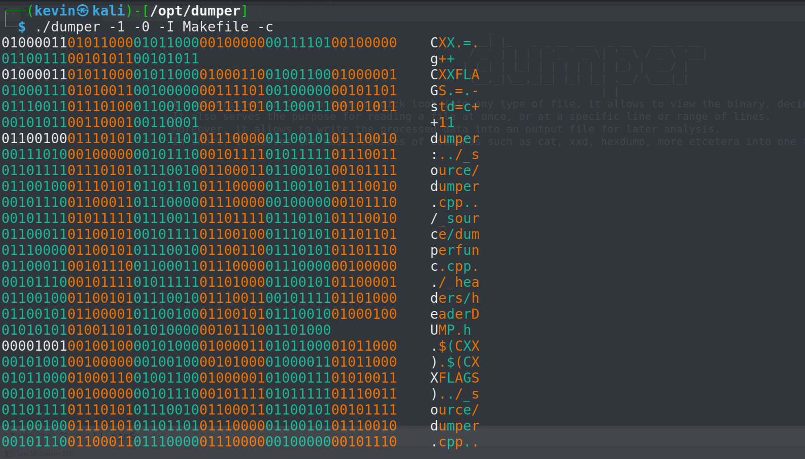
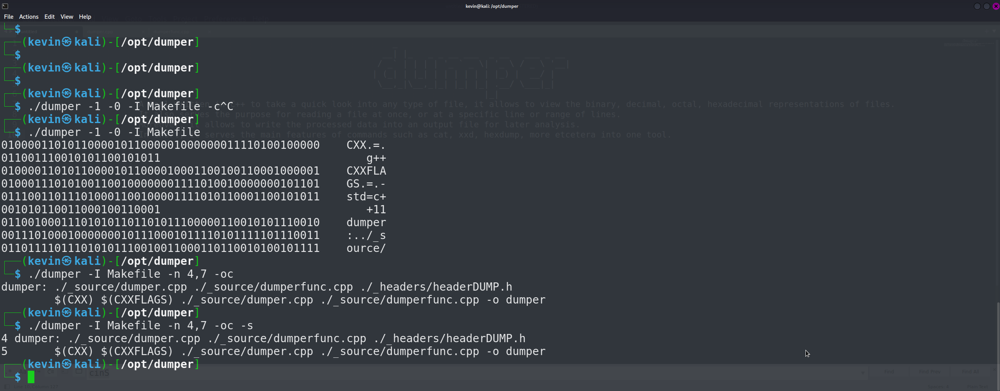
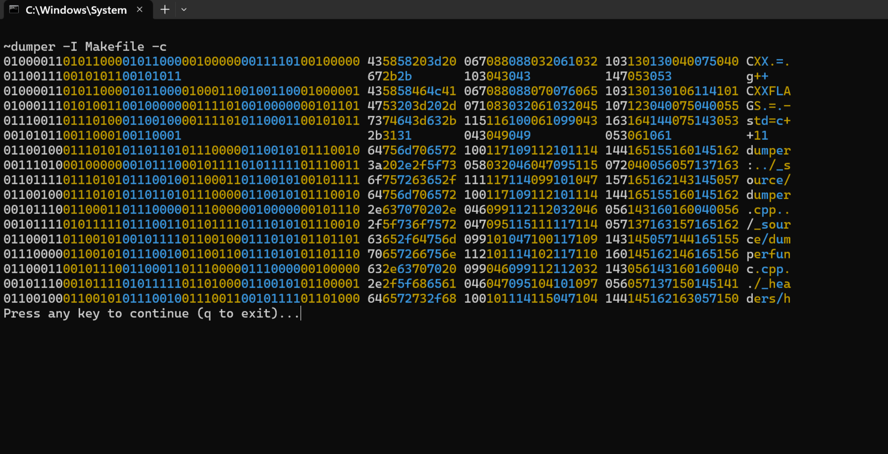

                              _                                 
                            __| |_   _ _ __ ___  _ __   ___ _ __ 
                           / _` | | | | '_ ` _ \| '_ \ / _ \ '__|
                          | (_| | |_| | | | | | | |_) |  __/ |   
                           \__,_|\__,_|_| |_| |_| .__/ \___|_|   
                                                |_|              
# dumper
A tool written in C++ to take a quick look into any type of file, it allows to view the binary, decimal, octal, hexadecimal representations of files.
It also serves the purpose for reading a file at once, or at a specific line or range of lines.
Moreover, it allows to write the processed data into an output file for later analysis. 
In short, it serves the main features of commands such as cat, xxd, hexdump, more etcetera into one tool.

How to install?
> You can simply clone this whole repository and use it.
> or you can download it in a compressed file format.

After downloading?
> compile the file using c++ compatible compiler, or make use of `make ` to compile it if it is installed.

How to use it?
> Tool Usage

What can it be used for?
> It can be used for reading files as whole, or only a specific line or a range of lines. It can also be used to take a quick look into the file to check the header and magic numbers, and viewing binary, octal, decimal, or hexadecimal representation of file. If no file is passed then it also read string passed as argument.

